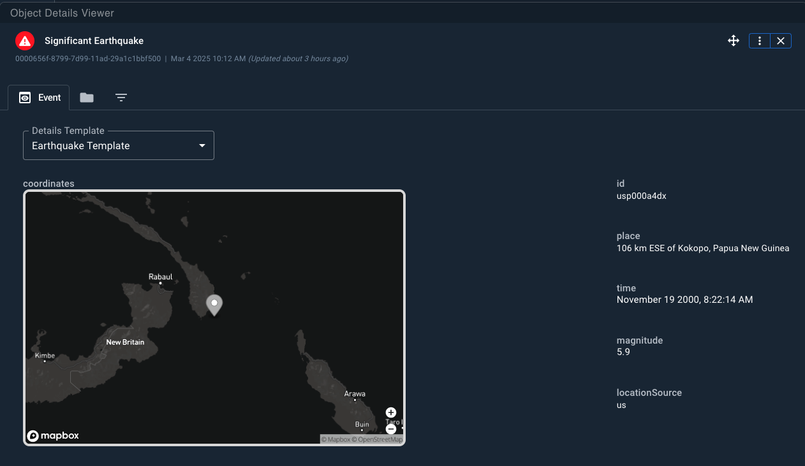
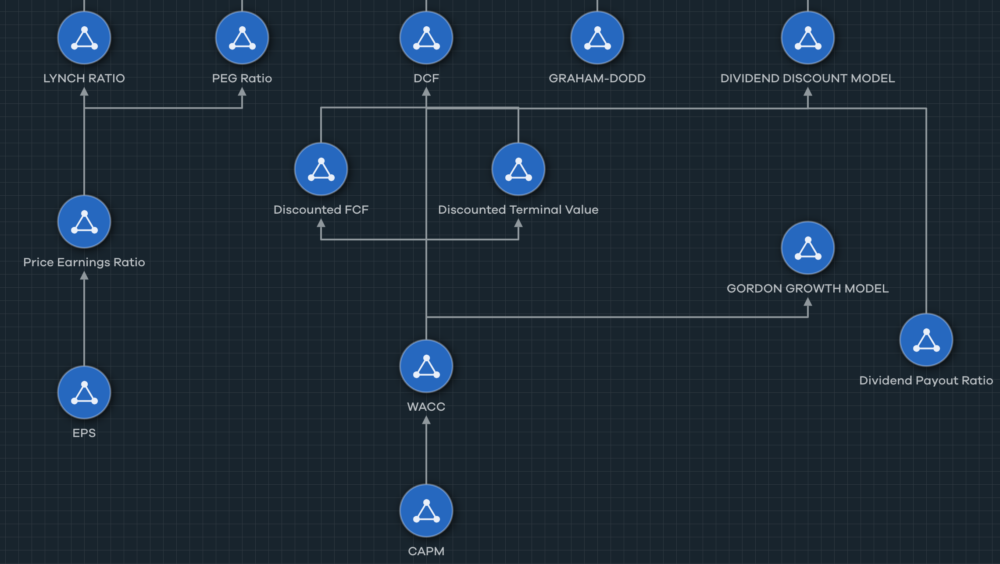
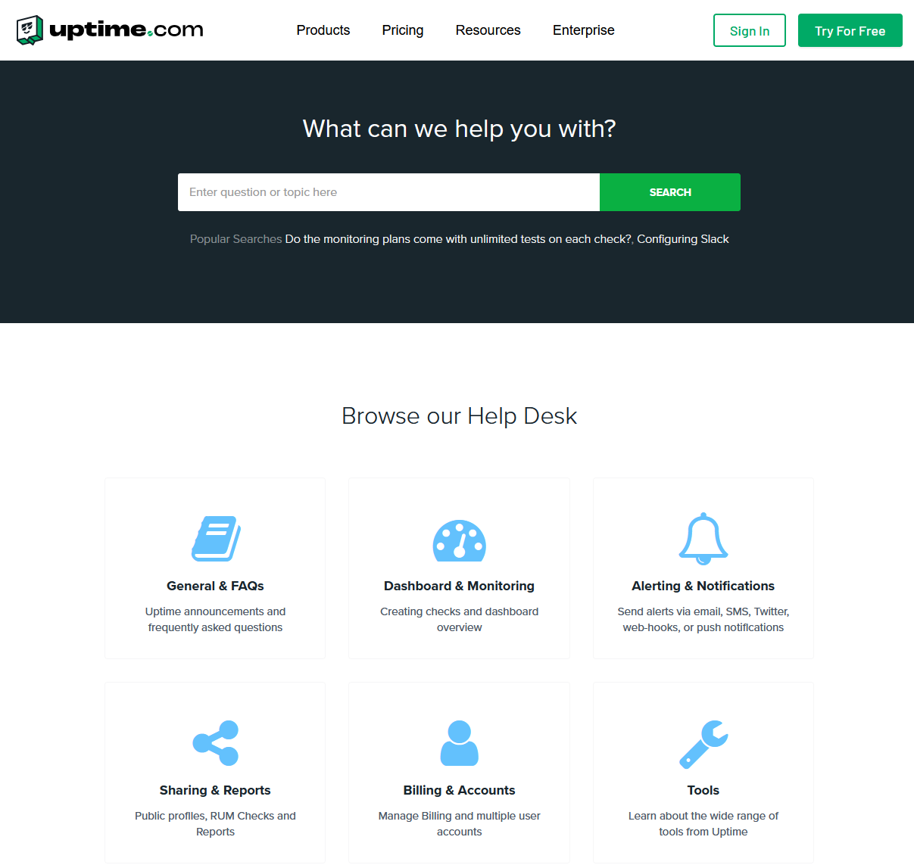

| | | | | |
| --- | --- | --- | --- | --- | 
| [Home]({{ '/' | relative_url }}) | [Blog]({{ '/blog/' | relative_url }}) | [Resume]({{ '/resume-tw.html' | relative_url }}) | [References]({{ '/references.html' | relative_url }}) | **Work samples** |

[Back](index.html)

## Writing Samples

I've collected a series of my best technical documentation, API docs, and blogs for review.

1. [Evergreen examples of API and software documentation.](#evergreen)
2. [Published and public samples](#published-and-public)
    1. [Kustomer documentation.](#kustomer-docs)
    2. [Cogility documentation.](#cogility-docs)
    3. [Cogynt's Sample Projects.](#cogility-sample-projects)
    4. [Uptime.com documentation.](#uptimecom-docs)

### Evergreen

[Sample API Documentation - ODPDiscGolfTrading](other-samples/opd-api-docs-example.html) 

  * Designed to showcase simple Authorization and calls, with sample response and request details. 
  * Detail oriented, using real-world examples that require structure and thoughtful design. 
  * Includes coded examples and technical instruction. 
  * Structured with assistance from Google Gemma, written and edited by a human.

[Axiomatic Digital Compass Support Documentation](other-samples/axiomatic-example.html) 

  * Designed to showcase typical writing for a user-facing and less technical audience. 
  * Includes screenshots, UI diagrams, simplified and readable instruction. 

[Axiomatic API Documentation](other-samples/axiomatic-api-docs-example.html) 

  * Designed to showcase endpoints demonstrating a real-world use case.
  * Includes sample response and request data, and technical instruction.  

[Changing a bike tire](other-samples/10-speed-bike-tube-replacement.html)

* Made for the DRT 1.1 Mountain Bike.
* Demonstrates hardware technical writing prowess.

[Intro to GraphQL](other-samples/intro-graphQL.html)

* Written as an evergreen technical sample.
* Uses a popular standard with a published reference to quickly view and track changes.

[GraphQL Brief](other-samples/GraphQL-brief.pdf)

* Written as an evergreen technical sample.
* Demonstrates ability to make formal change requests. 

### Published and Public

I have archived each of these samples to preserve my work, but each sample should still be publicly accessible from their respective sources. 

#### Kustomer Docs  

1. [Quick‑Start: Adding a Customer with Kustomer’s Node SDK](other-samples/quick-start-guide-Kustomer.html)
2. [Using evaluations with the Kustomer API](https://developer.kustomer.com/kustomer-apps-platform/docs/using-evaluations-with-the-kustomer-api)
3. [Kustomer Voice Runbook](other-samples/The-Kustomer-Voice-Runbook.pdf)

An API guide on using Kustomer Evaluations. Before I began my work, this guide did not exist and this endpoint was largely undocumented. 

After my work at Kustomer:

* Backlog reduction increased to 30% weekly
* Research, draft, edit skills driving every phase of docs creation
* Not just documenting Kustomer API, using it for drafting and managing content

#### Cogility Docs

Before I came to Cogility, docs were:

  * **Monolithic and difficult** to skim and search.
  * **Burying important technical detail** in marketing language.

After my work on [docs.cogility.com](https://docs.cogility.com). Docs became:

  * **Structured, with version control and automated linting in place.**
  * Tagged with keywords and **easy to search**.
  * **Written in simple English** with useful functions taking priority.
  * **Styled according to Microsoft's Style guide** and our in-house rules and branding.
  * See some selected samples below: 

[Advanced Mapping Guide for Advanced Report Builder](cogynt_docs/Advanced_Mapping_Guide_Cogynt.pdf) 

  * Describes each function in detail, including what each call returns.
  * Includes technical instruction, tables showing requests and sample responses, links to downloadable example templates.  

[Configuring the Cogynt AI](cogynt_docs/Configuring_Cogynt_AI_Cogynt.pdf) 

  * Describes chatbot interaction and prompting.
  * Includes detailed prompt examples, tested ideas for bot development, sample AI configuration settings, and instructional content. 

#### Cogility Sample Projects

Before I started: 

  * Cogynt onboarding was **measured in months**. 
  * The product was powerful, but **new users were not fully utilizing modeling capabilities or features**. 

I developed **10+ sample projects to accelerate onboarding** through real-world use cases. My work:

  * Featured **tiered projects** to **onboard every level of user**, from beginner to advanced.
  * **Reduced 70% of onboarding to weeks**, with most advanced users completing onboarding within one month.
  * Used real-world data and practical ideas.
  * Directly correlated to a **15% increase in feature adoption** and a **30% bump in new model creation**. 
  
[Laying the Groundwork](cogynt_docs/Laying_the_Groundwork_Cogynt_Docs.pdf) 
  
  * Describes how to upload files in Cogynt.
  * Includes workflow diagrams and technical instruction. 
  
[Stock Analysis](cogynt_docs/Real-Time_Stock%20Valuation_with_Cogynt.pdf) 
  
  * Describes modeling five stock analysis formulas to value stocks. 
  * Includes model diagrams, formula breakdowns, bayesian risk explanations, and definitions behind risk thresholds. 

#### Uptime.com Docs

Before my work on [Uptime.com's Documentation](https://web.archive.org/web/20230122142102/https://support.uptime.com/hc/en-us), docs were:

  * Written by engineers for engineers. **Overly technical** and **lacking in instruction**.
  * **Lacking image and video content**, making them **difficult to browse and read**.
  * Ticket requests were not documented, **increasing same-issue tickets and devouring support resources**. 

After my work:

  * Repeat requests **decreased by 30% month over month**, as measured in ZenDesk Support.
  * Proactive documentation **reduced bug tickets by 15% month over month**, as measured in ZenDesk Support.
  * **Feature adoption increased by 18%** as measured by in-app analytics. 
  
[API Check Documentation](Uptime_docs/API_Check_Basics–Uptime.com.htm) 
  
  * Describes methods for using the API check, including password masking, sample requests and responses, and advanced multi-step check construction.
  * Includes screenshots from the UI, code examples, sample response and requests, technical instruction. 
  
[API Documentation](Uptime_docs/Getting_Started_with_Uptime.com_REST_API.htm)
  
  * Describes Authorization and basic API functionality for the Uptime.com REST API. Meant for less technical users and beginners. 
  * Includes screenshots and UI callouts, technical instruction for authorization, and descriptions for each endpoint. 

[Uptime.com Author Page (Archived)](https://web.archive.org/web/20231202220840/https://uptime.com/blog/author/richardb)
 
[99.9% Uptime](Uptime_docs/What_Does_99_9_Uptime_Mean.htm)
    
  * Describes what 99.9% means in technical detail, conversational tone, SEO optimized. 
  * **Increased search traffic month over month by 30%**, as measured by blog analytics.

[G2 Article](Uptime_docs/Choose_Website_Monitoring_Provider.htm) 

* Partnered with G2 crowd to create a thought leadership piece aimed at assisting customers looking for web monitoring. 
* **Expanded search real estate through G2**, creating a **major boost in credibility** and **adding external search links for SEO**. 